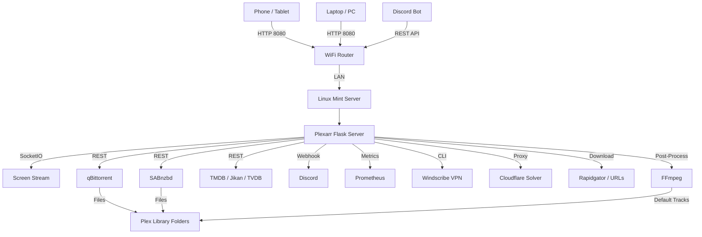

<div align="center">

<h1 style="font-family: 'Space Grotesk', sans-serif; font-weight: 700; font-size: 48px; background: linear-gradient(135deg, #f0ff66, #aaff66, #44ffaa); -webkit-background-clip: text; -webkit-text-fill-color: transparent; background-clip: text; margin-bottom: 8px;">
  Plexarr <span style="color: #00d4aa">V2.1</span>
</h1>

<p style="font-family: 'Inter', sans-serif; color: #94a3b8; font-size: 16px; max-width: 600px; margin: 0 auto 20px; line-height: 1.6;">
  <strong>Remote Media Command Suite</strong><br>
  Built for Linux Mint servers. Accessible from any device on your LAN.<br>
  Torrents, Usenet, auto-renaming, VPN, FFmpeg, Discord, and more.
</p>

<p>
  <a href="https://github.com/Compromisee/Plexarr/releases"></a>
  <a href="https://github.com/Compromisee/Plexarr/actions"></a>
  <a href="https://github.com/Compromisee/Plexarr/issues"></a>
  <a href="LICENSE"></a>
</p>

<p>
  <a href="#features">Features</a> &bull;
  <a href="#architecture">Architecture</a> &bull;
  <a href="#quick-start">Quick Start</a> &bull;
  <a href="#client">Client</a> &bull;
  <a href="#documentation">Docs</a> &bull;
  <a href="#packing">Packing</a>
</p>

</div>

---

## Features

| | |
|:---|:---|
| **Torrent Search** | Nyaa.si, YTS, EZTV, AnimeTosho, TorrentGalaxy, 1337x (with optional Cloudflare solver) |
| **Usenet / NZB** | SABnzbd integration, NZBGeek search support |
| **Auto Renamer** | guessit-powered parser, 100+ release tag stripping, Plex-compliant paths |
| **FFmpeg Post-Process** | Default English audio/subtitle tracks, strip unwanted languages, detect naming variations like `MediaHub-eng` |
| **LAN File Sharing** | Drag & drop upload from any device to Plex library folders, with auto-categorize WiFi upload endpoint |
| **URL Downloader** | Direct HTTP downloads, Rapidgator (premium + free), batch queue |
| **Batch Queue** | Select multiple torrents, queue up to 50 items, auto-process |
| **Watch Folder Auto-Categorize** | Drop files into a folder and Plexarr auto-detects type (TV, movie, anime, music) and sorts to Plex paths |
| **VPN Control** | Windscribe CLI integration — connect, disconnect, status from web UI |
| **Remote View** | SocketIO JPEG screen stream, click-to-control mouse, keyboard input |
| **Metadata** | TMDB (movies + TV), Jikan v4 (anime), TVDB (seasons), cover art + backdrops |
| **Discord** | Webhook notifications, Doplarr-style bot with slash commands |
| **Prometheus / Grafana** | Custom metrics endpoint, pre-built dashboard JSON |
| **Tautulli / Overseerr** | Proxy status and activity endpoints |
| **System Tray** | Minimize to tray, notifications, quick actions |
| **Cross-Platform** | Server: Linux. Client: Windows, macOS, Linux. No Node.js or Electron. |

---

## Architecture



---

## Quick Start

### Server (Linux Mint)

```bash
git clone https://github.com/Compromisee/Plexarr.git
cd Plexarr/server
python3 -m venv venv
source venv/bin/activate
pip install -r requirements.txt
python app.py
```

Server binds to `0.0.0.0:8080`.

### Client (Any Device)

Open a browser and go to `http://your-server-ip:8080`.

Or build the standalone desktop client:

```bash
cd Plexarr/client
pip install -r requirements.txt
python launcher.py --server auto --verbose
```

---

## Client

The Plexarr Client is a standalone desktop app built with **PyWebView** and **JetBrains Mono**.

### Features

- **System Tray** — Minimize to tray, quick search, quick quit
- **Auto-Reconnect** — Monitors server health, reconnects automatically
- **Server Discovery** — Scans your LAN for Plexarr servers automatically
- **Debug Console** — Built-in JS console for the webview (F12)
- **Keyboard Shortcuts** — Ctrl+Shift+S (search), Ctrl+Shift+M (mini), Ctrl+Shift+P (toggle), F12 (debug)
- **Mini Mode** — Floating window for monitoring torrents
- **Multi-Server Profiles** — Switch between multiple Plexarr servers
- **Portable Mode** — Store config next to the executable
- **Offline Cache** — Browse cached results when offline
- **Screenshot** — Capture the client window instantly
- **Auto-Updater** — Check for new releases on startup
- **Theme Support** — Dark, light, system themes
- **Import/Export Config** — Move settings between machines
- **Notification Sounds** — Audio alerts for download completions
- **Bandwidth Display** — Live download/upload speed in tray tooltip
- **Quick Actions Panel** — Keyboard-accessible command palette
- **Profile Switching** — One-click server switching

### Build Client

See [Packing.md](Packing.md) for detailed build instructions.

#### Windows

```bash
cd client
pyinstaller --onefile --windowed --name PlexarrClient --icon=assets/icon.ico main.py
```

#### macOS

```bash
cd client
pyinstaller --onefile --windowed --name PlexarrClient --icon=assets/icon.icns main.py
```

#### Linux

```bash
cd client
pyinstaller --onefile --windowed --name PlexarrClient --icon=assets/icon.png main.py
```

Or build an AppImage:

```bash
python -m nuitka --standalone --onefile --linux-icon=assets/icon.png main.py
```

---

## Documentation

Full documentation is hosted on GitHub Pages:

- [Home](https://compromisee.github.io/Plexarr/) — Overview & architecture
- [Setup Wizard](https://compromisee.github.io/Plexarr/setup.html) — Step-by-step configuration
- [LAN & WiFi](https://compromisee.github.io/Plexarr/lan.html) — Server detection & file sharing
- [Features](https://compromisee.github.io/Plexarr/features.html) — Complete feature reference
- [API Docs](https://compromisee.github.io/Plexarr/api.html) — Full REST/WebSocket API reference
- [Configuration](https://compromisee.github.io/Plexarr/config.html) — Config keys & security
- [Integrations](https://compromisee.github.io/Plexarr/integrations.html) — Discord, Grafana, Tautulli, etc.
- [Troubleshooting](https://compromisee.github.io/Plexarr/troubleshooting.html) — Common issues & fixes

---

## Configuration

All server settings live in `server/config.json`. Key fields:

| Key | Default | Description |
|-----|---------|-------------|
| `server.host` | `0.0.0.0` | Bind address |
| `server.port` | `8080` | HTTP port |
| `server.verbose` | `false` | Verbose logging |
| `paths.tv` | `/media/plex/TV Shows` | Plex TV library |
| `paths.movies` | `/media/plex/Movies` | Plex movie library |
| `paths.anime` | `/media/plex/Anime` | Plex anime library |
| `qbittorrent.host` | `http://localhost:8080` | qBittorrent Web UI |
| `sabnzbd.host` | `http://localhost:8080` | SABnzbd API URL |
| `tmdb.api_key` | `""` | Free from [TMDB](https://www.themoviedb.org/settings/api) |
| `discord.webhook_url` | `""` | Discord server webhook |
| `vpn.enabled` | `false` | Enable Windscribe control |
| `cloudflare_solver.enabled` | `false` | Enable Cloudflare bypass |
| `ffmpeg.enabled` | `true` | Auto-process downloads |
| `url_downloader.rapidgator.premium` | `false` | Rapidgator premium mode |
| `batch_download.max_queue` | `50` | Max batch items |
| `naming.variations` | `[...]` | Custom naming groups to detect |

Edit via the Settings tab in the web UI or directly in the JSON file.

---

## Screenshots

<p align="center">
  
  <br><br>
  
  <br><br>
  
</p>

---

## Packing

See [Packing.md](Packing.md) for complete instructions on building executables for:

- **Windows** — `.exe` with PyInstaller or Nuitka
- **macOS** — `.app` bundle with PyInstaller or Nuitka
- **Linux** — Binary or AppImage
- **Server** — systemd service, LaunchAgent, or NSSM

Includes CI/CD GitHub Actions workflow for automated builds.

---

## Security

- **LAN Only** — Designed for trusted local networks. Do not expose port 8080 to the internet.
- **VPN** — Use Tailscale, WireGuard, or reverse proxy (nginx/Caddy) with HTTPS for remote access.
- **Remote Control** — Disabled by default. Only enable on trusted networks.
- **Cloudflare Solver** — Bypasses anti-bot protection. Use responsibly and only for legitimate access.
- **CORS Proxy** — Can fetch arbitrary URLs. Restrict to trusted clients.

---

## Contributing

1. Fork the repository
2. Create a feature branch (`git checkout -b feature/amazing-feature`)
3. Commit your changes (`git commit -m 'Add amazing feature'`)
4. Push to the branch (`git push origin feature/amazing-feature`)
5. Open a Pull Request

---

## License

MIT License. See [LICENSE](LICENSE) for details.

<p align="center">
  <br>
  <a href="https://github.com/Compromisee/Plexarr">
    
  </a>
</p>
